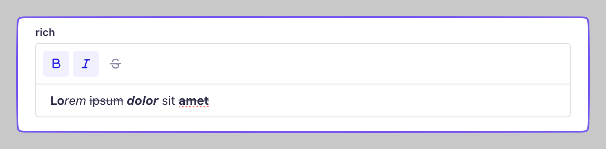

# 📝 Strapi Plugin: Single Line Rich Text

A minimal rich text field for [Strapi](https://strapi.io) content types.  
Supports **bold**, _italic_, and ~~strikethrough~~ formatting — all in a single line.

Built with [Tiptap](https://tiptap.dev/) and designed for simplicity.



## ✨ Features

- Single-line rich text input
- Basic formatting: **bold**, _italic_, ~~strikethrough~~
- Keyboard shortcuts supported
- Prevents multiline input (no `Enter` key)
- Seamless integration with the Strapi admin panel

---

## 🚀 Installation

Using your favorite package manager:

```bash
npm install single-line-editor
# or
yarn add single-line-editor
# or
pnpm add single-line-editor
```

## 🧩 Usage

In the Strapi Content-Type Builder, add a new Custom Field.

Choose: `Single Line Editor`

Save and use as a single-line formatted input in your collection types.

## 🛠 Customization

Out of the box, the plugin limits formatting to:

- `Bold` (⌘/Ctrl + B)

- `Italic` (⌘/Ctrl + I)

- `Strikethrough` (⌘/Ctrl + Shift + X)

No headings, lists, or multi-line input are allowed.

## 🧑‍💻 Contributing
Pull requests and improvements are welcome!

If you'd like to add more formatting options, toolbar buttons, or settings — feel free to fork or open a PR.

## 📄 License

[MIT](./LICENCE)

